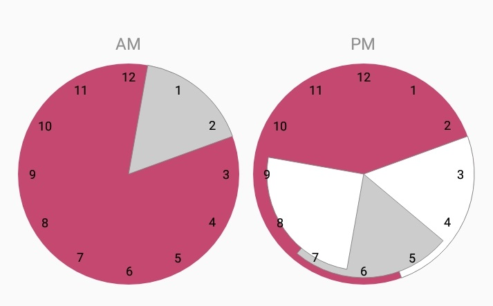
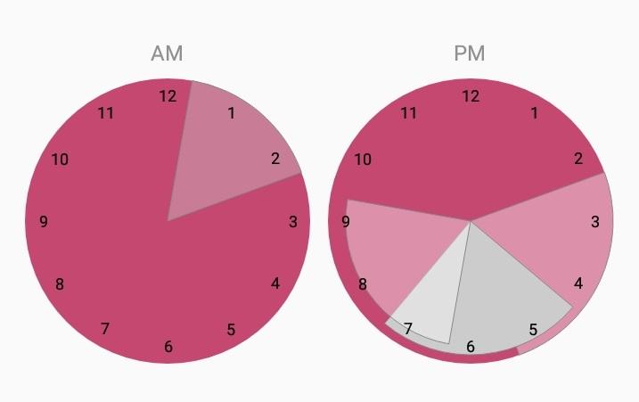

# TimesView

## About

This view can show time periods on an analog clock:

<br>
(`TimesView` showing 4 time periods)

## Install

In app bulid.gradle:

```
dependencies {
    ...
    implement 'me.ahmedy.android.timesview:1.0.2'
}
```

## How To Use

Add the view to your layout
```xml
<me.ahmedy.android.timesview.TimesView
        android:id="@+id/sample_times_view"
        android:layout_width="match_parent"
        android:layout_height="300dp"
        app:clockBackgroundColor="@color/colorPrimary"
        app:clockTimeTextColor="@color/colorAccent"
        app:AMPMTextColor="@color/colorPrimaryDark"/>
```

Create an instance of the `TimesView` class and initialize it with the view

```java
TimesView timesView = findViewById(R.id.sample_times_view);
```

After that start adding your time periods to `timesView` object

```java
List<TimePeriod> timePeriods = new ArrayList<>();
Calendar startTime = Calendar.getInstance();
Calendar endTime = Calendar.getInstance();
startTime.set(Calendar.HOUR_OF_DAY, 0);
endTime.set(Calendar.HOUR_OF_DAY, 2);
timePeriods.add(new TimePeriod(startTime, endTime, Color.LTGRAY));

timesView.setTimePeriods(timePeriods);
```
Each time period to be added must be of `TimePeriod` class. `TimePeriod` class takes two times as `Calendar` and the color to be used to render this period on the analog clock.


You can also select one of the periods in the list to make it more visible if needed:

```java
timesView.selectTimePeriod(2);//selecting index 2
```



You can then clear the selection:

```java
timesView.clearSelection();
```


## XML attributes:

```xml
<me.ahmedy.android.timesview.TimesView
    ...
    app:clockBackgroundColor="@color/colorPrimary"
    app:clockTimeTextColor="@color/colorAccent"
    app:AMPMTextColor="@color/colorPrimaryDark"/>
```
`clockBackgroundColor` is the color of the two circles. Alternatively:
```java
timesView.setClockBackgroundColor(Color.BLACK);
```

`clockTimeTextColor` is the color of the hours written in the clocks. Alternatively:
```java
timesView.setClockTimeTextColor(Color.BLACK);
```

`AMPMTextColor` is the color of the two words 'AM' & 'PM' written above the clocks. Alternatively:
```java
timesView.setAm_pmTextColor(Color.BLACK);
```
